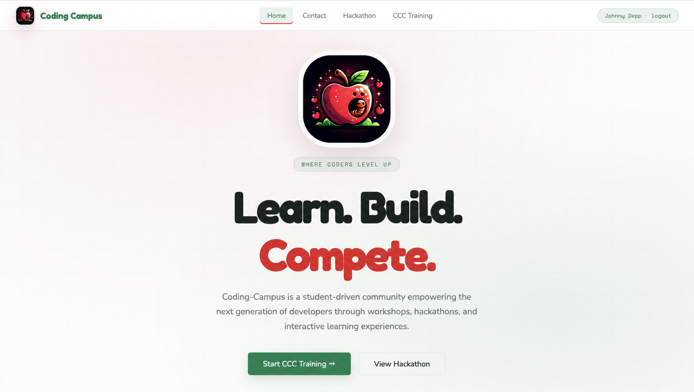
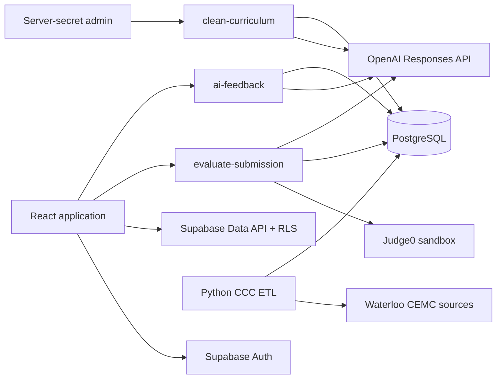

# Coding Campus

Coding Campus is a student-focused learning platform for building programming
skills through Waterloo CCC practice, interactive code execution, AI-guided
feedback, workshops, and hackathon content.



## Highlights

- **Waterloo CCC curriculum** — authenticated learners can work through real
  Junior and Senior contest problems from 2022–2025 in a progressive timeline.
- **Interactive programming workspace** — Monaco Editor supports Python, C++,
  and Java with starter templates, saved drafts, custom input, sample cases,
  execution metrics, test results, a full workspace reset, and an acceptance
  celebration.
- **Secure code judging** — a Supabase Edge Function sends submissions to
  Judge0 with CPU, memory, process, file-size, source-size, and network limits.
  Hidden test inputs and expected outputs never reach the browser.
- **AI learning coach** — OpenAI provides structured diagnoses, progressive
  hints, concepts to review, next steps, and complexity guidance without
  revealing a complete replacement solution.
- **Reviewable curriculum cleanup** — an admin-only OpenAI workflow identifies
  malformed Unicode, raw LaTeX, PDF line wraps, and inconsistent text. Proposed
  edits are stored separately and require explicit approval.
- **Supabase authentication** — email/password registration, persistent
  sessions, automatic learner profiles, and Row Level Security for user data.
- **Apple Hacks archive** — a visual timeline presents the opening ceremony,
  Roboflow workshop, Python workshop, hackathon guidance, and closing ceremony
  with custom covers, summaries, and YouTube recordings.
- **Extensible DSA quiz library** — reusable quiz data and UI components cover
  arrays, linked lists, graphs, sorting, complexity, stacks, binary search,
  trees, tries, heaps, and backtracking alongside the active CCC experience.
- **CCC data pipeline** — a Python ETL system discovers official contest
  sources, parses HTML or PDF fallbacks, validates normalized records, and
  transactionally upserts problems, commentary, samples, and subtasks.
- **Responsive brand system** — the red, white, and green interface uses the
  Coding Campus apple mark throughout the home, contact, hackathon, auth, and
  training experiences.

## Architecture



The browser receives only the Supabase URL and publishable key. Judge0,
OpenAI, database-administration, and hidden-test credentials remain in
server-side Supabase secrets.

## Technology

| Layer | Technologies |
| --- | --- |
| Frontend | React 18, Create React App, Monaco Editor, CSS |
| Authentication and data | Supabase Auth, PostgreSQL, Data API, Row Level Security |
| Serverless backend | Supabase Edge Functions, TypeScript, Deno runtime |
| Code execution | Judge0 CE through RapidAPI |
| AI | OpenAI Responses API with strict structured outputs |
| Data pipeline | Python 3.11+, Beautiful Soup, Pydantic, pypdf, Requests |
| Testing | React Scripts/Jest, pytest, Ruff, Deno check/lint |
| Hosting | Vercel frontend and hosted Supabase backend |

## Repository layout

```text
.
├── frontend/                    React application source
├── public/                      HTML shell and committed image assets
├── data-pipeline/               Waterloo CCC Extract → Transform → Load system
├── supabase backend/            Migrations, Edge Functions, and local config
├── docs/assets/                 README media
├── package.json                 Frontend dependencies and scripts
└── SUPABASE_SETUP.md            Additional Supabase authentication notes
```

Create React App normally looks for `src/`, and the Supabase CLI looks for
`supabase/`. With the current descriptive folder names, create compatibility
links before running locally on macOS/Linux:

```bash
ln -s frontend src
ln -s "supabase backend" supabase
```

Alternatively, rename the folders to `src/` and `supabase/`. Do not create both
a real conventional directory and its compatibility link.

## Local frontend setup

### Prerequisites

- Node.js 18 or newer
- npm
- A Supabase project

Install dependencies:

```bash
npm install
```

Create `.env.local` from `.env.example`:

```dotenv
REACT_APP_SUPABASE_URL=https://YOUR_PROJECT_REF.supabase.co
REACT_APP_SUPABASE_PUBLISHABLE_KEY=sb_publishable_YOUR_KEY
```

Only use the publishable browser key here. Then start the application:

```bash
npm start
```

## Database setup

The ETL schema creates `problems`, `problem_commentary`, `sample_cases`,
`subtasks`, and the transactional loader function. Apply
`data-pipeline/sql/001_ccc_schema.sql` to the Supabase database first.

The migrations in `supabase backend/migrations/` add:

- learner profiles and quiz attempts;
- authenticated curriculum read policies;
- code submissions and private AI feedback;
- server-only hidden judge cases;
- reviewable curriculum-cleanup proposals.

Link the project and apply pending migrations:

```bash
npx supabase login
npx supabase link --project-ref YOUR_PROJECT_REF
npx supabase db push
```

Configure the production Site URL and allowed redirect URLs under Supabase
Authentication settings for both localhost and the Vercel domain.

## Edge Functions

Copy `supabase backend/.env.functions.example` to the ignored
`supabase backend/.env.functions` file and provide server-side values:

```dotenv
JUDGE0_URL=https://judge0-ce.p.rapidapi.com
JUDGE0_API_KEY=YOUR_RAPIDAPI_KEY
JUDGE0_API_HOST=judge0-ce.p.rapidapi.com

OPENAI_API_KEY=YOUR_OPENAI_API_KEY
OPENAI_MODEL=gpt-5-mini
```

Upload the secrets and deploy:

```bash
npx supabase secrets set --env-file "supabase/.env.functions"

npx supabase functions deploy evaluate-submission
npx supabase functions deploy ai-feedback
npx supabase functions deploy clean-curriculum
```

### `evaluate-submission`

- Requires an authenticated learner.
- Supports Python, C++, and Java.
- Runs custom input without grading in **Run** mode.
- Grades up to 20 server-side cases in **Submit** mode.
- Records status, score, runtime, memory, and passed-test totals.
- Automatically requests coaching after an incorrect submission when OpenAI is
  configured.
- Rate-limits submissions and truncates untrusted runner output.

### `ai-feedback`

- Requires an authenticated learner.
- Grounds feedback in the problem statement, official commentary, learner code,
  and verified submission evidence.
- Produces a fixed JSON shape for reliable frontend rendering.
- Stores feedback privately under the requesting user.

### `clean-curriculum`

- Requires a server-side Supabase secret key and must never be called from the
  browser.
- Scans allowlisted curriculum tables and columns in bounded groups.
- Stores original text, deterministic cleanup, OpenAI proposal, confidence,
  change notes, and review flags.
- Applies a proposal only when the source text still matches the scanned
  version, preventing stale overwrites.

See
[`supabase backend/functions/clean-curriculum/README.md`](supabase%20backend/functions/clean-curriculum/README.md)
for the scan, review, apply, and reject workflow.

## CCC data pipeline

The Python pipeline prefers official Waterloo HTML pages and falls back to
contest/commentary PDFs from official archives when necessary. It validates
contest completeness before writing and makes each problem update atomic.

```bash
cd data-pipeline
python3 -m venv .venv
source .venv/bin/activate
pip install -e '.[dev]'
```

Validate all 2022–2025 Junior and Senior sources without database writes:

```bash
python main.py --archive --start-year 2025 --end-year 2022 \
  --archive-pages 3 --dry-run
```

To load data, set server-side pipeline credentials and omit `--dry-run`:

```bash
export SUPABASE_URL=https://YOUR_PROJECT_REF.supabase.co
export SUPABASE_KEY=YOUR_SERVER_SIDE_KEY
python main.py --archive --start-year 2025 --end-year 2022 --archive-pages 3
```

See [`data-pipeline/README.md`](data-pipeline/README.md) for source discovery,
single-contest runs, JSON output, and pipeline extension details.

## Testing

Frontend tests and production build:

```bash
npm test -- --watchAll=false
npm run build
```

Pipeline tests and linting:

```bash
cd data-pipeline
pytest
ruff check .
```

Edge Function checks:

```bash
npx --yes deno check \
  --config "supabase backend/functions/evaluate-submission/deno.json" \
  "supabase backend/functions/evaluate-submission/index.ts" \
  "supabase backend/functions/ai-feedback/index.ts" \
  "supabase backend/functions/clean-curriculum/index.ts"

npx --yes deno lint "supabase backend/functions"
```

## Vercel deployment

Configure these Vercel project variables for Production and Preview:

```dotenv
REACT_APP_SUPABASE_URL=https://YOUR_PROJECT_REF.supabase.co
REACT_APP_SUPABASE_PUBLISHABLE_KEY=sb_publishable_YOUR_KEY
```

With the current `frontend/` source directory, use this Vercel build command:

```bash
ln -s frontend src && npm run build
```

Set the output directory to `build`. Supabase Edge Function secrets are managed
in Supabase, not Vercel.

## Security

- Never commit `.env.local`, `.env.functions`, database passwords, service-role
  keys, OpenAI keys, or RapidAPI keys.
- A Supabase publishable key is designed for browser use; database protection
  comes from grants and Row Level Security.
- Hidden judge cases have no `anon` or `authenticated` table privileges.
- Users can read only their own submission and AI-feedback history.
- Code runs in Judge0 with network access disabled and explicit resource limits.
- Curriculum-cleanup proposals are private and require a server-secret apply
  request.

## Community

- [LinkedIn](https://www.linkedin.com/company/103302082/)
- [Instagram](https://www.instagram.com/codingcampus_org/)
